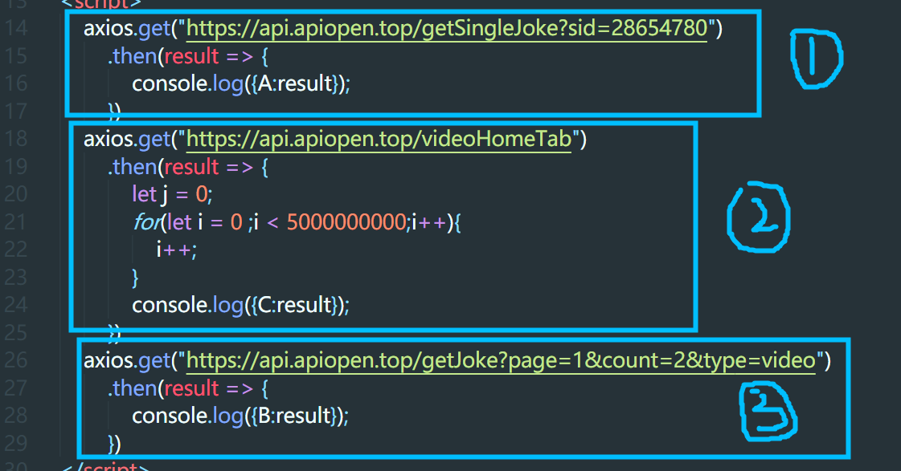

# 杂记🤓🤓🤓
* (`递归`):不是说递归就要return，仅仅遍历一遍树状结构不用return东西
* (递归):return的东西原路返回了。
* (CommonJS):暴露是module.exports 注意有个"s"
* (CommonJS):CommonJS的导入方式是同步的
* (browserify):用来将commonjs方式require的包导入至代码上端
* (babel):用来将ES6代码转为ES5代码
* (node_modules):可执行文件在/node_modules/.bin目录下
* (CommonJS):CommonJS借助browserify工具实现require（browserify index.js -o bundle.js）
* (ES6 Module):es6-module借助babel进行es6->es5(babel ./src --out-dir ./lib),然后借助browserify实现require(browserify index.js -o bundle.js)
* (工作)困了的话就戴耳机听歌
* (git)终端查看git提交记录 git log --graph
* (gitk)一个git提交记录查看命令工具
* (代码健壮)对数组的判断:Array.isArray(data) && data.length || []
* (shell)接受参数：$0,$1
* (Generator生成器):*号声明的函数第一次执行产生生成器，后续通过next()进行逐步调用
* (call和apply):注意call和apply的调用者是被修改this指向的对象，call和apply的第一个参数是新的this，第二个开始参数是新this需要的参数
* (Generator生成器):next()方法中参数可以设置上一个yield的返回值
* (深拷贝浅拷贝):解构赋值是深拷贝，不要被结构赋值对象里面的基本数据类型和引用输入类型搞混
* (sass):注意sass待转换文件必须是xxx.sass文件(捂脸.gif)
* (sass):sass的几个关键点:嵌套、变量、混合器、继承、导入
* (sass):  :global用来覆盖UI库样式
* (闭包):闭包一定要有return吗？
* (call和apply)：注意call和apply修改了某函数的this执行并且立即执行，bind需要手动再执行
* (框架):框架中data的更新与UI层的渲染，注意复杂数据类型更新UI层无感的情况，注意key的使用
* (Object.prototype.toString):判断类型，Object.prototype.toString()永远的神。let ts = Object.prototype.toString() ts.call(待判断对象)
* (无穷大与无穷小):Infinity和-Infinity
* (引用数据类型)：注意引用数据类型之间的赋值问题。（写leetcode的回文字符串时候数组的赋值。应该用深拷贝而不是直接赋值）
* (异步):异步处理的发展:回调函数 --> promise --> Generator --> async await --> RXJS
* (函数):函数语句和函数表达式。函数语句存在提升的情况。
* (迭代)：基于函数的迭代比基于循环的迭代要慢一些。
* (dom):createDocumentFragment()作为子dom添加进父dom时，只会将documentFragment其所有的子孙节点添加给父dom，不包括docuemntFragment其自身。
* (虚拟DOM算法)：并不是虚拟DOM就比真实DOM操作要快,而是用虚拟DOM算法去操作真实DOM，比直接操作真实DOM性能更高。
* (虚拟DOM算法):虚拟DOM算法 = 虚拟DOM + DIFF算法
* (Math.random()):获取min和max之间的随机数：(Math.random() * (max - min)) + min
* (Math.random()):获取min和max之间的整数(包括max和min)：Math.floor((Math.random() * (max - min + 1))) + min
* (箭头函数):箭头函数后的函数体不带花括号即默认return
* (CSS选择器):选择除第一个元素后的其他元素:p:not(:nth-child(1)){color:pink}
* (some 和 every)：some中当return了一个true,就不再循环。every中return了一个false,就不再循环。
* (React 源码):render方法实际上是调用了React.createElement方法(ReactElement方法)
* (避免操作state):避免操作结构赋值取得的state的方法目前是：{...state.xxx,newKey:newValue},用扩展运算符扩出新的对象。或者JSON.paurse(JSON.stringify(state.xxx))深拷贝
* (浅拷贝的坑)：不要忘记浅拷贝的坑，类似moment对象的使用
* (some和every)：之前记住的some返回一个true就停止循环，every返回一个false就停止循环，注重的是循环的过程。some只要数组中某一元素满足条件即返回true,every需要数组中所有元素满足条件才返回ture,强调的是返回值。
* (好看的webstorm字体)：Raleway                                        │~                                                                     
* （元素的宽高）:元素的宽等于 width + border*2 + padding*2             │~                                                                     
* (content-box)：width就是width,border就是border,padding就是padding    │~                                                                     
* (border-box)：width+2*border+2*padding == 设置的width，width会被borde│~                                                                     
r和padding挤压。
* (事件委托):事件委托就是将元素的事件委托给他的父级元素或更外级的元素处理，实现机制就是事件冒泡。
* (addEveneListener):addEventListener有三个参数(event,function.useCapture),第三个参数决定事件处理函数在哪个阶段被调用(冒泡阶段 和 捕获阶段)
* (阻止事件冒泡): 子元素设置：event.stopPropagation() 或者直接 return false
* (事件委托):为父元素绑定某事件之后，通过event.target.nodeName.toLowerCase()==="li" 的方法判断被点击元素的tagName
* (系统盘制作软件):balenaEtcher和rufus
* （虚拟机软件）:qemu
* (较有用的apt命令):apt -f install ; apt --fix-broken install ; apt autoremove
* (高阶函数):高阶函数的说法来自于函数式编程，函数作为参数进行传递，类似map、reduce、filter这都是高阶函数，因为他们传递就是函数参数。
* (函数式编程)：函数式编程把一切变成关注点为 输入 和 输出
* (学习渠道): youtube视频、掘金、leetcode
* (git):git几个方面 ：完美的commit、分支策略、pull request、
* (vim快捷键)：格式化代码: gg = G
* (字符串方法): split() 通过括号内符号对字符串进行数组化分割，若传递""则挨个数组化
* (变量初始化):变量使用时是什么类型，初始化时就采取什么类型。
* (说给自己听的):敲代码就像是在用铁镐敲击大岩石块，凿一下凿一下的破开它。
* (快速生成数组):new Array(个数).fill("")
* (WSL2):这是个酷毙了的东西。😀😀😍😍
  * (递归):
      ``` javascript
               // 递归为树状数组添加层级标识
          let arr = [
          {
              title:"test"
          },
          {
              title:"test",
              children:[
                  {title:"test2"},
                  {title:"test2"},
              ]
          },
          {
              title:"test",
              children:[
                  {
                      title:"test2",
                  },
                  {
                      title:"test2",
                      children:[
                          {title:"test3"},
                          {title:"test3"},
                      ]
                  },
              ]
          },
      ]
      function setLevel(arr){
    
          // 私有函数
          function setLevelFun(arr,level){
              level++;
              arr.map(item => {
                  item.level = level;
                  if(item.children){
                      setLevelFun(item.children,level);
                  }
              })
          }
    
          setLevelFun(arr,0)
      }
      setLevel(arr);
      ```
* (linux):大胆的去看软件里面的配置文件。
* (Linux PATH)：~/.profile文件 和 /usr/local/bin目录(软链接) 
* (work):要持续的联系测试人员，不能停滞。
* (中序遍历):中序遍历是从小到大依次遍历。
	```javascript
		function middleConsole(callback){
			// ---- 私有函数 -----
			function middleConsoleFun(node,callback){
				if(node !== null){
					middleConsoleFun(node.left,callback);
					callback(node);
					middleConsoleFun(node.right,callback);
				}	
			}

			middleConsoleFun(root,callback());
		}
	```
* (先序遍历):先序遍历是中间节点优先于子孙节点被遍历
* (后序遍历)：后序遍历是中间节点落后于子孙节点被遍历
* (二叉树遍历):都是围绕着中间节点来的。
	* 中序遍历：在三个节点中，只要是中间节点，就是第二个被遍历的（node.left最先被遍历）
	* 先序遍历；在三个节点中，只要是中间节点，就是最先被遍历的
	* 后续遍历：在三个节点中，只要是中间节点，就是最后被遍历的。

* (左右查询):<你不知道的js>第一章中的LHS和RHS
	* LHS:操作的赋值目标是谁
	* RHS:谁是赋值操作的源头
* (右查询的意义)：如果RHS查询在所有的嵌套作用域中寻找不到所需要的变量，引擎就会抛出ReferenceError异常。
* (异常):ReferenceError该异常同作用域判别失败相关。
* (右查询和referenceError异常):
	```javascript
		console.log(a);
		当RHS查询失败的时候，抛出ReferenceError.
		因为无法找到 操作赋值的源头。

		问题：为什么 a = 1 ,不会抛出ReferenceError
			因为 a = 1,执行的是LHS左查询。如果找不到 被赋值操作的目标，那么就声明该变量继续赋值操作。
	```
* (var and let) : 可以这样理解，var 的最小作用域单位是函数作用域，let 的最小作用域单位是{}
* (匿名函数和立即执行函数):注意匿名函数是匿名函数，立即执行函数是立即执行函数。
* (全局变量):for循环的循环条件中使用var定义的i变量，是全局变量或者函数变量。
* （let）：和上面相对于，for循环中使用let定义的i变量，只作用于该循环体作用域。
* （提升）：声明会被提升，赋值留在原地。函数声明会被提升，函数表达式不会被提升。
* (异常):TypeError:xxx is not a function 例子：undefined();  let a = 123;a.map(() => console.log("asdf"));
* (提升与停留):
	```javascript
	// 总是记得变量的声明提升，但是却忽略赋值操作的原地停留。
	test(); // TypeError  (is not a function)
	myFun(); // ReferenceError (is not defined)
	var test = function myFun(){
		console.log(":)");
	}
	```
* (var): 重复的无赋值的声明会被省略。
	```javascript
		var test = ":)";
		var test;
		console.log(test); // ":)"
	```
* (提升):函数声明的提升的最小作用域单位是 块级作用域 {}
	```jvascript
		fun(); // TypeError 
		function fun(){
			console.log(":)");
		}
	```
* (闭包)：闭包的作用之一：从外部访问函数内部的变量
	```javascript
		function outter(){
			let test = "被你发现啦！";
			function inner(){
				return test;
			}
			return inner;
		}
		const myFun = outter();
		console.log(myFun()); // "被你发现啦！"
	```
* (闭包)：闭包强调的是外部函数的函数作用域未被回收。外部函数的函数作用域仍被内部函数给引用。
* (闭包):闭包的作用之一： 闭包使得内部函数得以继续的使用其定义位置的词法作用域。
* (闭包):经典的for循环问题
	```javascript
		for(var i=0;i<3;i++){
			setTimeout(() => {console.log(i)},1000);
		}
		// ---- 代码的表面语义：每隔1s输出当前i的值；----
		// ---- 实际执行结果：在一秒后直接输出3个3；----
		// ---- 首先明确一点，for循环是同步代码，setTimeout是异步代码（event loop），----
		// ---- 异步代码肯定在同步代码执行完毕之后执行（重点1） -----
		// ---- 且var i 这样的写法使得在全局作用域中只有一个i（重点2） ----
		// ---- 所以最终一次性输出3个3；
		
		// ---- 使用闭包解决这个问题（实现单独作用域） ----
		    for(var i =0; i < 3;i++){
        		(function(){
            		  var j = i; // ---- 这个var的作用域为当前匿名函数作用域 ----
            		  setTimeout(() => {
                	  console.log(j);
            		},1000);
        	    })()
		// ---- 简化版本 ----
		    for(var i =0; i < 3;i++){
        		(function(j){
            		  setTimeout(() => {
                	  console.log(j);
            		  },1000);
        		})(i)
    		    }
		// ---- 总结：虽然说使用闭包，但我觉得更像是利用了var的最小活动作用域是函数作用域这一特性 ----
		// ---- ！！！更新：已经不理解上面那句自己写的是什么意思了，这里的解释应该是，每次循环生成了不同的各自的匿名函数，每个匿名函数维护着其参数i。 
		// ---- 同理，那么我们可以利用let最小活动作用域是块作用域这一特性，直接劫持每一次循环产生的块作用域。
		    for(let i =0; i < 3;i++){
        		setTimeout(() => console.log(i),1000);
    		    }
		// - 为什么用let直接就可以，用var不行呢？
			// - 首先明确一下var和let的最大区别:var的最小活动范围是函数作用域，let的最小活动范围是块作用域。
			// - 看下面两个例子：
			for(var i=0; i<5; i++){
				//...
			}
			console.log(i); // - 在循环体外输出i,结果为5。
			
			for(let j=0;j<5;j++){
				//...
			}
			console.log(j); // j is not defined;
			// - 上面两个例子可以看出，由于var的最小活动范围实际是函数作用域，for循环应该属于块作用域，{var i = 0;}在该块作用域外是可以访问到i的，所以整个for循环对于外部作用域来说只维护着同一个var i；
			// - let的最小活动范围是块作用域，所以每次循环维护的let i是各自不同的i。
    }
	```
* (while循环):break语句和return可以跳出while循环。
* (翻墙):shadowsocks-libev永远的神。用apt下载,支持新方法
* (工作)：项目上线到正式一定要去看
* (linux):linux开启某个端口的命令 sudo ufw allow 8888 或者 sudo ufw allow from 192.168.1.0/24 to any port 8888
* (React风格)：关于 子组件的state问题 子组件的state越多，组件耦合度越低，反之亦然。
* (深拷贝):JSON.parse(JSON.stringify())有个很大的缺点：深拷贝对象的时候会过滤掉内容为函数的对象属性。
* (前端与id)：1.使用Date: Date.now() / new Date(); 2.配合使用Math.round()和Math.random()
* (return): 双重循环中内循环return会使得两个循环都终止。
* (纵向遍历): ["flower","flowers","flowsss"] 记得leetCode上面的最长前缀那道题的纵向解法。
* (this):this一句话：this的指向完全取决于函数在哪里被调用💨💨💨
* (空对象):创建空对象的方法：一、{} 二、Object.create(null) 后者不会创建Object.prototype这个委托，所以更空。
* (this):箭头函数的this无法被修改。
* (css):父元素设置了padding,子元素如何不受这个来自父元素的padding影响呢？为子元素设置对应的 负margin
* (对象)：为对象属性的属性值设置一个函数，该函数并不是属于该对象，而是被该对象某个属性给引用。
* (Object.assgin):该方法实现对一个对象的拷贝。旧对象根据其属性数据类型，对修改新对象的属性做出不同反应。
* (delete):当使用delete关键字删除对象某个函数或对象类型属性，且该对象属性是对该函数或对象的最后引用者，该函数或对象就可以被垃圾回收。
* (writable和configurable):前者是的对象属性不可被重新赋值。后者另该对象不可被defineProperty
* (defineProperty):如何定义一个对象常量属性？使用Object.defineProperty(obj,"key",{writable:false,configurable:false})
* (对象配置):禁止扩展(preventExtensions)、密封(seal configurable:false)、冻结(freeze configurable:false,writable:false)。
* (对象): 
	``` 
		let obj = {name:"tttjh"};
		"name" in obj; // true; in关键字会检查原型链。
		obj.hasOwnProperty("name"); //true; hasOwnProperty不会检查原型链
	``` 
* (对象属性的可枚举性):
	* Object.keys() 返回一个数组，只包含该对象的可枚举属性。
	* Object.getOwnPropertyNames() 也返回一个数组，包含该对象的任何属性，无论是否可枚举。
* (const):const定义的应用数据类型，其属性可以改变(修改、增加、删除),但不可以为这个引用数据类型重新赋值。
* (双重循环):明白双重循环到底是怎样在循环。
* (master): master分支是最后的保障，当某个功能分支的公共文件被误改动，需要从master分支上复制出最新旧最稳定的版本进行还原。
* (React哲学):如何区分state和props
	* 当该值在组件中一成不变的时候，他是props;
	* 当该值可以被props或state计算出来的时候，他既不用props也不用state
* (子组件 与 父组件)：
	* 通过子组件触发某事件以修改父组件内容，需要通过父组件以props方式传递给子组件对应的方法。
	* 通过父组件触发某事件以修改子组件内容，需要通过子组件传递其自身的ref给父组件让父组件调用子组件身上的某个方法，修改子组件自身内容。
* (印象深刻的例子):
	* 生产业绩-方舱推送维护：
	* 一共两个弹窗组件A和B：A组件是父组件，B组件是子组件。
		* 当B组件中的表格项被勾选的时候，A组件中的select组件中需要回显被勾选的项。
		* 当A组件中的select组件进行取消选择的时候，B组件中表格项也需要被取消勾选。
		* B组件表格onChange事件中接收来自父组件A的修改父组件A select被选中项的方法，实现B组件表格项影响A组件Select组件。
		* A组件需要得到B组件的ref,如果B组件是class组件，就直接获取其整个ref,如果B组件是函数组件，就获取其暴露的对应的方法。从而实现父组件调用子组件方法，修改子组件内部的值。
* (写题)：写题的时候，可以对输入内容进行排序化、去重化处理。

* (new关键字) ： new生成的对象，该对象的[[prototype]]会指向该函数的prototype
* (new关键字)：构造函数的实例的__proto__属性 指向其 构造函数的 prototype属性。所以，这就是原型链。🧔🧔🧔
* (函数参数)：不应该在函数中直接修改函数的参数。
* (Object) const anotherObj = Object.create(obj); anotherObj这个新生成的对象的__proto__会指向obj的(__proto__还是prototype)
* (原型链)：学习原型链的时候，区分认识prototype和__proto__
* (原型链)：
	* 函数的prototype属性对象上，有一个不可枚举属性---constructor.
	* controctor这个属性指向函数自身
	* ```
	function Fun(){};
     	Fun.prototype.constructor == Fun; // true
	// 由于原型链的存在所以
	const fun = new Fun();
	fun.conscructor === Fun; // 芜湖
* (原型继承)：
	```
// ----- 原型继承 -----
function Father(game){
    this.game = game;
}

Father.prototype.getGame =function() {
  return this.game;
}

function Son(name,sport){
    Father.call(this,name); // ---- 继承 ------
    this.sport = sport;
}

Son.prototype = Object.create(Father.prototype); // ---- 原型继承 -----

const son = new Son("COD","NBA");

console.log(son);

console.log(son.getGame());
	```
* (结合原型链谈instanceof): instanceof用于判断一个对象是否是一个函数的构造函数式调用方式的产物，那他的判断依据是什么呢？
	* 就是判断该对象原型链上[__proto__]有无指向构造函数.prototype属性
* (splice方法)：splice方法返回的是数组。
* (Math.max) Math.max搭配扩展运算符数组实现寻找数组最大值。
* (echarts的配置项记录):
	```javascript
		const yAxisConfig = {
				minInterval: 1, // ---- y轴最小间隔，确保为整数 ----
			}


	```
* (三重循环):遍历每一项数组(第一个元素)，在遍历过程中使用左右指针(第二个和第三个元素)
* (return): return语句只用在函数体中，否则报错。(函数体中的for循环可用)
* (建议)：从数据的获取阶段进行数据格式优化，而不是在每次渲染阶段。
* (canvas)：canvas的rotate,按照画布的左上角原点(0, 0),进行旋转，旋转后注意对应的x轴和y轴。
* (判空处理): 判空处理的模拟空数据可以为: 空数组[]、空对象{}、
* (Object) Object.prototype.hasOwnProperty() // --- 检测某个对象中是否含有该属性 --
* (for...in):for...in遍历某个对象的可枚举属性。
* (Object):Object.prototype.entries(); // 将某个对象的key和value二维数组化。G
* (typeof): typeof 总是返回一个字符串
* (声明与赋值): 通常都是判断一个变量有无被赋值(已声明)；那么如何判断一个变量有无被赋值呢？
```javascript
	if(params){ // ---- 报错：params is not defined ! ----
		console.log("该变量已经声明");
	}else{
		console.log("该变量未曾被声明");
	}

	// ---- 可以这样来进行判断变量有无被声明 -----
	if(typeof params !== 'undefined'){
		console.log("该变量已经被声明")；
	}else{
		console.log("该变量未曾被声明");
	}
```
* (Array):Array.prototype.slice.call()  该写法可以使得被传递进去的参数(多为伪数组)转换为真数组。
	* 详细如下：①相当于让slice方法函数内部的操作对象(this),被替换成了该参数(例如:arguments)
	* 然后xxx.slice(),返回自身，是个数组，就把伪数组转换为了数组。

* (prototype):问题：一个字符串，怎样让他受到join方法(数组的方法)的影响，添加指定间隔符号？
	* let str = "helloworld";
	* Array.prototype.join.call(str, "-"); // 'h-e-l-l-o-w-o-r-l-d'
	* str // "helloworld"

* (NaN):判断NaN的方法
	* Number.isNaN()
	* NaN是唯一的自身不等于自身的家伙。 if(n !== n){return "这是NaN!"}
* (-0):-0的这个负号，是其方向符号，有时候会用到。
* (prototype):
	Array.prototype 是一个空数组[]
	Function.prototype是一个空函数{}
	Object.prototype是一个空对象{}
	可以在进行默认赋值的时候使用这三个东东，因为他们只会执行一次，便一直存在，不会重复声明。
```javascript
	function fun(param1 = Function.prototype, param2 = Array.prototype, param3 = Object.prototype){
        // ----- 如果调用该函数时不传参，默认参数值为空函数、空数组、空对象
        console.log({
                param1,
                param2,
                param3,
        });
        }	

        fun();
	// --- 输出 ----
	{
	  param1: {},
	  param2: Object(0) [],
	  param3: [Object: null prototype] {}
	}
	
```
* (冲突):当前分支与dev分支和master分支都有冲突，那么，应该先从master分支拉取一个分支命名为 冲突解决 分支，将当前分支合并到 冲突解决 分支上，然后将冲突解决分支合并到dev和master。

* (String.prototype.split): const str = "\ntutu\ntutu"; str.split("\n"); // ["", "tutu", "tutu"];
* (原型链):原型链的尽头是 Object.prototype
* (flex):
	* justify-content:
		* space-between: 左右不留白，元素之间距离均分。
		* space-evenly: 左右留白，元素之间距离均分。
		* space-around: 左右留白，留白宽度为元素之间距离宽度的一半。
* (css): 不要忘记cala属性！！！
* (dom和ajax):
	* 在这捋一下
	* dom应该优先于数据渲染，页面暂时展示真实dom加空数据，或者loading.
	* ajax应该在dom渲染完毕之后,.then()来更新数据状态，从而dom中的数据得以更新。
	* 所以应该分为domRender函数和ajaxFun函数。
* (this指向问题):在不同类型的prototype的方法中输出的this,该this指向调用该prototype上方法的那个对象。
	* 例子：
	* [11,22,33].map(item => {doSomething()});
	* Array.ptototype.map这个方法中的this目前指向的就是[11, 22, 33]这个数组。
	* 这个貌似有别于之前在《我不知道的JS》中了解到的this指向的相关知识，特殊记忆一下。
* (三点运算符)
	* 三点运算符做形参的时候，获取的时候就是数组形式。
* (异步)：循环中的异步操作，是个很奇怪的东西。
	* 循环内的所有异步操作，会等外层所有循环循环完毕之后，一同输出。
* (异步)：接着上面的问题，一个循环中，循环内部代码是个setTimeout(异步操作)，这里有两点需要注意：
	* 第一点：输出i的话(不用let声明的情况下),i的值都是同样的最后一个i
	* 第二点：他们是同时输出的，不是挨个输出。
* (原型)：
	* 构造函数的prototype和实例化对象的__proto__指向同一个地方。
* (原型):原型链继承：指的就是实例化函数使用其__proto__上的方法。
* (原型链)：原型链调用就是顺着__proto__调用
	* xxx.__proto__
	* xxx.__proto__.__proto__
	* xxx.__proto__.__proto__.__proto__
* (Object.create):
	* let obj = {}
	* let obj2 = Object.create(obj);
	* let obj2.__proto__ === obj; // true
* (递归)：
	* 最基础的使用递归实现的深拷贝
	* 我觉得这个例子来理解递归也很不错。
	* 最重要的是这一行：resultObj[key] = deepClone(obj[key])
	* deepClone()函数的再次调用，让我们从honor层进入到FF15层再进行复制和赋值。
	* 等到honor的内容被填充完毕，然后return honor,作为obj的一个属性。
```javascript
let obj = {
        name:"tttjh",
        games:[
                "FF15",
                "COD",
                "GTA",
        ],
        gamesTime:{
                FF15:"48h",
                GTA:"68h",
                COD:"28h",
        },
        honor:{
                FF15:{
                        gold:8,
                        whiteGold:16,
                },
                GTA:{
                        gold:12,
                        whiteGold:18,
                }
        }
}

// --- 深拷贝 ---
function deepClone(obj){
  if(typeof obj !== "object"){
    return obj;
  }else{
    let resultObj = {};
    for(key in obj){
      resultObj[key] = deepClone(obj[key]);
    }
    return resultObj;
  }
}

console.log(deepClone(obj));
```

* (git) 如何判断当前分支是从基于哪一个分支建立的
	* git reflog show <childBranch>
* (state):
	* react框架中，setState和react hook在合成事件(onClick,onChange)中是异步的。
	* 推测依据是，在一个点击事件函数中，前面循环输出一万条字符串，for循环后面加个setState，可以看到setState已经完成，for循环还在跑呢，以此可以推断在合成事件中呈异步表现。

* (state):
	* setState在原生事件和setTimeout中是同步的。
	* setState的批量更新册罗会对其进行覆盖，取最后一次的执行。
	* 如果是同时setState不同的值，在更新的时候会对其进行合并批量更新。
* (正则表达式):	
	* 注意^和$的使用。
* (正则表达式)：
	* 金额格式化 / 千位符号
	* let reg = /\B(?=(\d{3})+(?!\d))/g
* (递归)：
	* 理解递归的时候可以只想到第二层，在最简单的递归模式中想逻辑即可，剩下的都交给电脑解决。
* (typeof):
	* typeof [] // object
	* typeof null // object
	* typeof {} // object
	
* (原型遍历)：
	* for...in...会遍历出其原型对象上的方法或属性
* (moment):
	* moment对象具有startOf和endOf方法,用于获取某个时间对象的某个时间段的最早或最晚
* (antd):
	* antd中，formItem的initValue和Select组件组合使用的时候，
	* 设置的initValue应该是Select组件的option的value值，而不是label名。
* (React hook):
	* 函数式组件通过forwardRef向父组件暴露自己的dom.
	* 函数式组件通过useImperativeHandle和forwardRef来向父组件暴露自身的某些方法。
* (函数防抖)：
	* 我举得函数防抖才是利用闭包特性。
	* debounce函数并不会立即消失，因为内部函数引用着其timer变量。
	```javascript
	document.addEventListener("mousemove", debounce());
        function debounce () {
                let timer;
                 return function(){
                        clearTimeout(timer);
                        timer = setTimeout(() => {
                                console.log(":)");
                        }, 1000);
                 }
        }
	
	```
* (NaN):
	* Number.isNaN只检测NaN
	* isNaN不仅检测NaN还检测所有不可以转换为数字类型的东西。
* (addEventListener):
	* 事件绑定的第三个布尔类型参数是用来决定事件的出发类型：true:捕获阶段 false:冒泡阶段
* (防止冒泡)：
	* e.stopPropagation()
* (数组去重):
	```javascript
	let arr = [11,11,11,22,22,33];

	let obj = {};

	arr.forEach(item => {
        	obj[item] = "";
	})

	console.log(Object.keys(obj));
	```
* (方法):
	* indexOf和includes的区别
	* indexOf不可以检测NaN
* (apply, call, bing):
	* 这几个修改函数this指向其他对象的方法的原理就是，将该函数赋值为被指向对象的方法即可。
	* 当函数作为对象的方法的时候，其this指向就是该对象。
* (伪数组转数组)：
	* 伪数组转数组的几种方法：
	* [...arguments]
	* Array.prototype.slice.call(arguments);
	* Array.from(arguments)
* (arguments):
	* 箭头函数中arguments不可用
* (函数柯里化)：
	```javascript
	/**
 * 将函数柯里化
 * @param fn    待柯里化的原函数
 * @param len   所需的参数个数，默认为原函数的形参个数
 */
 function curry(fn,len = fn.length) {
    return _curry(fn,len)
}
/**
 * 中转函数
 * @param fn    待柯里化的原函数
 * @param len   所需的参数个数
 * @param args  已接收的参数列表
 */
function _curry(fn,len,...args) {
    return function (...params) {
        let _args = [...args,...params];
        if(_args.length >= len){
            return fn(..._args);
        }else{
            return _curry(fn,len,..._args)
        }
    }
}
let _fn = curry(function(a,b,c,d,e){
    console.log(a,b,c,d,e)
});
_fn(1)(2)(3,4,5);   // print: 1,2,3,4,5
	```
* (Function):
	* 一个函数的length,是其参数的个数
* (函数柯里化)：
	* 对于已经柯里化后的_fn函数来说，当接收的参数数量与原函数的形参数量相同时，执行原函数。
	* 当接收的参数数量小于原函数的形参数量时，返回一个函数用于接受剩余的函数，直至接收的参数数量与形参数量一致并执行。
* (函数柯里化例子)：
	* 通过柯里化之后的_regTestCurry函数，之后无需再传递第一个参数，只要传递待检测字符串就可以了，更加的简便。
	```javascript
	        function curry(fn){
                return _curry(fn);
        }

        function _curry(fn, ...args){
                return function(...newArgs){
                        const allArgs = [...args, ...newArgs];
                        if(allArgs.length >= fn.length){
                                return fn(...allArgs);
                        }else{
                                return _curry(fn, ...allArgs);
                        }
                }
        }

        const regTest = (reg, item) => {
                return reg.test(item);
        }

        const regTestCurry = curry(regTest);

        const phoneRegTest = regTestCurry(/^[1]{1}[3-9]{2}[0-9]{8}$/);
        const emailRegTest = regTestCurry(/^\w+@[a-zA-Z]+.[a-zA-Z]{3,6}$/);

        const result = phoneRegTest("17739753629");
        const result2 = phoneRegTest("10008");

        const result3 = emailRegTest("11498585111@qq.com");
        const result4 = emailRegTest("sxxxxxx");

        console.log(result);
        console.log(result2);
        console.log(result3);
        console.log(result4);
	```
* (css选择器):
	```javascript
	<ul>
	    <p></p>
	    <li></li>
	    <li></li>
	    <li></li>
	</ul>
	```
	* li:nth-child和li:nth-of-type
	* 前者的选择范围包括<p> ---> <li>
	* 后者的选择返回只包括<li> ---> <li>
* (css选择器)：
	* 不选择第一个：
		* xxx:not(first-child(1))
		* xxx:not(first-of-type(1))
		* xxx:nth-of-type(n+1)
* (ts):type 联合类型
* (ts): ts里面定义一个指定类型的变量：let value: xxx = "value";
* (ts): ts的unknown类型只接受any类型和unknown类型的变量进行赋值。
* (三点运算符 与 括号形成的表达式)：
	* 不要小看括号的能耐
	* 如何在tag===false的时候，数组第三项不存在(注意是不存在，不是为空字符串或者空对象)
	* let obj = {test:"test"};
	* let tag = false;
	* let arr = [obj, obj, tag ? obj : {}]; // ❌ - 这样会让该数组第三元素仍旧存在，只不过为空对象 -
	* let arr2 = [obj, obj, ...(tag ? [obj] : [])]; // ✅ - 这样第三个元素并不存在，数组长度为2 -
* (this):
	* 函数作为对象的方法的时候，该函数内部的this指向该对象。
* (函数重载)：
	* 函数名称相同，函数的参数列表不同(包括参数个数 与 参数类型)，根据参数的不同去执行不同的操作。
* (fn和argument)
	* fn.length是形参的个数
	* argument.length是实参的个数
* (分支问题)：
	* 赵重构了总览页面，我接到需要更换总览页面上某套接口，我不能在赵的重构分支上进行改动，我应该拉赵的分支生成新分支，然后进行开发，避免赵发版从而一套带走我。
* (同步与异步):注意for循环中的异步操作，即使那些异步操作他携带了async或者await
* (ajax函数赛跑问题)：千万别再写出来这种ajax函数赛跑导致数据相互覆盖的bug代码了‼️‼️‼️‼️‼️
* (对象和filter):
	* filter方法在对象上进行使用的话，遍历出的是key。
* (事件冒泡)：
	* 通过子元素同时出发子元素的事件函数以及父元素的事件函数，但是父子的事件函数的event事件对象都是子元素的事件对象。
* (css)：visibility:hidden 搭配 opacity 实现渐入渐入美滋滋。
* (event):事件对象中的clientX/Y是鼠标相对于浏览器窗口的位置。offsetTop/Left是元素相对于外部元素的位置。
* (css):不是最后一个元素：:not(:last-child)
* (循环)：
	* for ... of 可以break但不可以return.
	* map和forEach 可以return但不可以break
* (递归扁平化数组):
	```javascript
		function takeOut(arr){
			let res = [];
			arr.forEach(item => {
				if(Array.isArray(item)){
					res = res.concat(takeOut(item));
				}else{
					res.push(item);
				}
			})
			return res;
		}
	```
* (数组方法)：forEach没有返回值！map有返回值！
* (哲学)：自己真的是个菜鸟，千千万万别自视清高，太幼稚太搞笑了，菜鸟论！菜鸟论！菜鸟论！
* (同步与异步)：
	* 循环中调用异步代码可千万千万要注意了！！！
* (栈和队列)：用两个栈模仿队列：
	* 
* (eChart):
	* 怎样实现eChart的双行X轴，并且第二行X轴是第一行X轴的一个总结轴。
	* xAxis设置为数组对象，第二行x轴单独设置postion、textStyle的fontSize和heightLine
* (字符串方法)：
	* String.prototype.toLowerCase()和String.prototype.toUpperCase()方法都只会将字符串中的英文字符进行大小写转换。
* (构造函数)：
	* 构造函数的私有变量是定义在this里面的。
* (时间复杂度)：
	* 只要算法里面没有递归和循环，就算有上万行代码,时间复杂度也是O(1)
* (栈时间复杂度为O(1)的min()方法)：
	* 
* (vim):全局搜索--- /keyWord 然后n或者N进行跳转。
* (typeScript):
	* ts中注意数据的源头的结构设置。
* (数据源)：
	* 再次强调，改变数据从数据源进行入手。
* (学习方法)：必要的时候还是要进行视频学习，更系统，更容易入手。
* (递归倒叙输出链表)：
	* 难得自己写出个递归
```javascript
	var reversePrint = function(head) {
	    if(!head){
        	return []
    	}
    	    let res = [];
    	function fun(node){
            if(!node.next){
                return [node.val];
            }else{
                return res = res.concat(fun(node.next), [node.val])
            }
        }
            return fun(head);
	};
```
* (position):
	* fixed和sticky的区别：
	* fixed相对于屏幕进行固定。
	* sticky相对于最近的可滚动祖先进行固定。
* (说话)：
	* 有机会一定 ---> 肯定有机会
* (this):
```javascript	  
var user = {
    		count:1,
    		getCount: function(){
      	  return this.count;
    	 }
         }

  const result1 = user.getCount(); // - 作为对象的方法调用，this指向该对象 -
  const func = user.getCount;
  const result2 = func(); // - 作为普通函数调用，this指向window -
  console.log({
    result1,
    result2
  })// - 1,undefined -
```
* (flex-shrink):
	* 计算原则：
	*     首先计算溢出空间量：子元素宽度总和 - 父元素宽度 = 溢出总量
 	      压缩总权重：子元素宽度*其flex-shrink + 子元素宽度*其flex-shrink....
              各自的压缩率： 子元素宽度*其flex-shrink / 总压缩权重
              元素压缩后的宽度：子元素宽度 - 溢出空间量*子元素各自压缩率
* (flex):
	* flex-grow的默认值是0
	* flex-shrink的默认值是1
* (回调函数)：
	* 回调与异步或同步没有直接的联系。
	* 又异步回调函数，也有同步回调函数。
* (回调函数)：
	* 当A函数作为B函数的参数传递给B函数，并在B函数代码执行完毕之后A函数执行，A函数就是回调函数.
* (单线程和异步)：
	* 我们都知道js是单线程的，这种设计模式给我们带来了很多的方便之处，我们不需要考虑各个线程之间的通信，也不需要写很多烧脑的代码，也就是说js的引擎只能一件一件事的去完成和执行相关的操作，所以所有需要执行的事情都像排队一样，等待着被触发和执行，可是如果这样的话，如果在队列中有一件事情需要花费很多的时间，那么后面的任务都将处于一种等待状态，有时甚至会出现浏览器假死现象，例如其中有一件正在执行的一个任务是一个死循环，那么会导致后续其他的任务无法正常执行，所以js在同步机制的缺陷下设计出了异步模式
	* 在异步执行的模式下，每一个异步的任务都有其自己一个或着多个回调函数，这样当前在执行的异步任务执行完之后，不会马上执行事件队列中的下一项任务，而是执行它的回调函数，而下一项任务也不会等当前这个回调函数执行完，因为它也不能确定当前的回调合适执行完毕，只要引它被触发就会执行，
* 事件队列
	* 下图有3个不同的请求分布请求不同的接口，其中设定请求速度如下：①快过②快过③
	* 下图的输出结果会是A最先输出，然后页面持续加载，最后按顺序输出C对象和B对象。
	* 页面加载后，三个请求被异步任务队列分别执行。
	* 当①请求请求完毕，①回调函数进入同步任务队列执行输出。
	* 之后②请求请求完毕，然后③请求也请求完毕。
	* 然后②回调函数一直会在同步任务队列中执行，执行完毕之后输出C对象，③回调函数进入同步任务队列执行，后输出B对象。
	* 
* (词法作用域 和 动态作用域)：
	* 词法作用域 是是在写代码的时候或者说定义的时候确定的。动态作用域反之。	
	* JS是词法作用域，看的是代码定义的位置。
    ```
    let a = "hello";
    function test(){
        console.log(a);
    }
    function anotherTest(){
        let a = "world";
        test();
    }

    anotherTest(); // - 输出的是hello,因为test函数是在全局定义的，寻找全局变量a，而不是看test函数调用位置的局部变量a
    ```
* (let和const):与var不同，let和const声明的变量不会作为window对象的属性！！！
* (this):
	* 当函数作为对象的方法的时候，其this指向为该对象，前提是该函数不是箭头函数。
	* 当箭头函数作为对象的方法的时候，其this仍旧指向外层this,一般也就是windows
* (构造函数)：
	* 构造函数中如果return了一个对象，根据该构造函数生成的实例化对象的this实际指向其构造函数返回的对象。
* (Iterator遍历器)：Iterator遍历器主要供for...of消费,遍历器本质上，就是个指针对象。
* (Iterator遍历器)：以下是个给对象部署iterator遍历器，使其可以被for...of...语法遍历的例子。
```
    const obj = {
        data:["11", "22", "33"],
        [Symbol.iterator]:function(){
            let index = 0;
            const that = this;
            return {
                next(){
                    if(index < that.data.length){
                        return {
                            done:false,
                            value:that.data[index++]
                        }
                    }else{
                        return {
                            done:true,
                            value:undefined,
                        }
                    }
                }
            }
        }
    };

    for(let item of obj){
        console.log(item); // 11,22,33
    }
```
* (http响应状态码)：
	* 304:无修改，通知客户端采用缓存
* (非对称加密)：
	* 非对称加密是指：用A钥匙上锁，就只能用B打开。用B要是上锁，就只能用A打开。把那个要是公开出去，这个钥匙就是公钥，另一个则是私钥。
* (构造函数调用)：
	* const x = new Boolean(false);
	* x是个对象，不是个布尔值。
* (学习方法)：
	* 对于我自己来说，我更适合以 问答 的形式来进行学习，可能是受高中学习方式的影响，以回答的方式让我更能记住该问题。
* (while循环):
	* while循环是可以return和break的。
* (基本字符串和字符串对象的区别)：
	* 请注意区分javascript字符串对象和基本字符串值。
	* let str1 = "helloworld"; // --- 基本字符串值
	* let str2 = String("helloworld"); // --- 基本字符串值
	* let str3 = new String("helloworld"); // --- 字符串对象
	* typeof str1; // string
	* typeof str2; // string
	* typeof str3; // object
	* 以上可知，通过直接字符串赋值和String方法(没有new)生成的就是 基本字符串值	
	* 通过new String构造函数生成的是字符串对象.
	* 但是为什么我们也可以通过直接生成的字符串变量调用字符串构造函数原型上的方法呢？
		* 是因为JS会自动将基本字符串值转变为字符串对象然后调用相对应的方法。
* (Set):ES6的Set数据结构的values方法返回的是Iterator
* (Set):如何使用Set进行数组去重：
		* const arr = [11,11,22,22,33,33];
		* const mySet = new Set(arr); // - 返回的是一个Iteror -
		* const newArr = [...mySet]; // [11,22,33]
		* 简写就是：[...new Set(arr)];
* (扩展运算符):
	* 扩展运算符内部使用的是for...of循环
	* for...of与遍历器Itertor相关
* (Set):集合的添加与查找元素时间复杂度皆为O(1)
* (常数操作)：和数据量无关的操作就是常数操作(数组寻址);
		* 链表查询就不是常数操作，因为找到执行链表节点，需要从头遍历链表。
* (异或)：^ 相同为0，不同为1.
